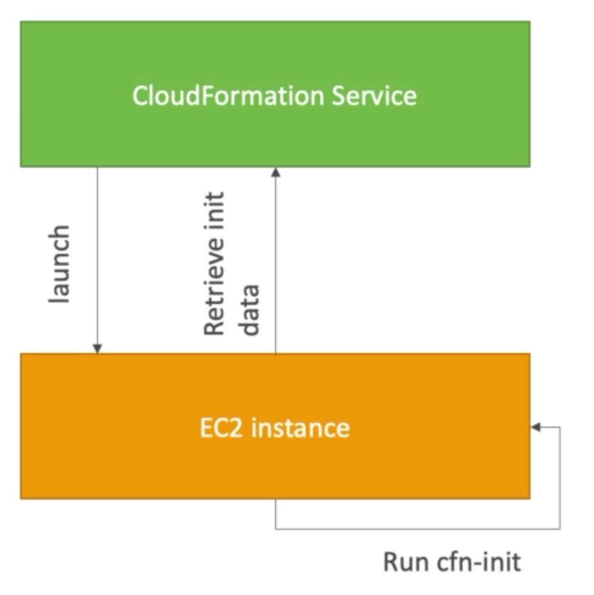
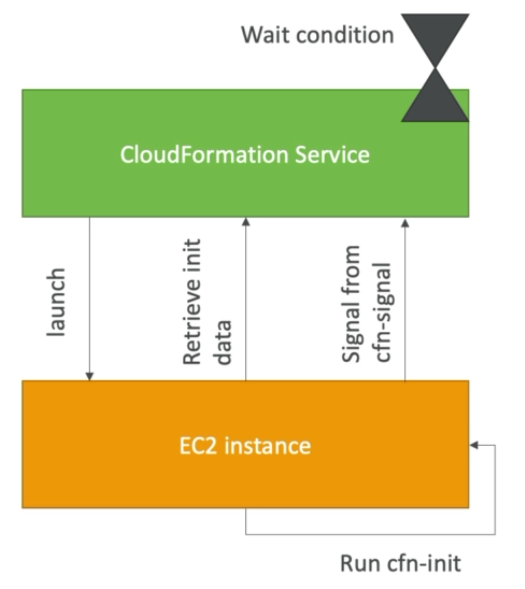
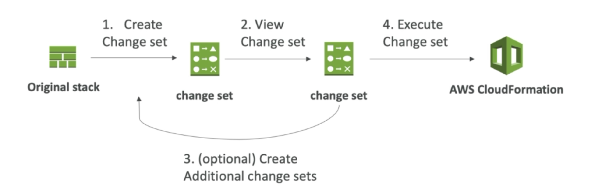

# CloudFormation

CloudFormation allows us to treat our infrastructure as code!

CloudFormation is a declarative way of outlining our AWS infrastructure, for any resources (most supported).

<!-- START doctoc generated TOC please keep comment here to allow auto update -->
<!-- DON'T EDIT THIS SECTION, INSTEAD RE-RUN doctoc TO UPDATE -->

**Table of Contents**

- [CloudFormation](#cloudformation)
  - [Parameters](#parameters)
  - [Pseudo Parameters](#pseudo-parameters)
  - [Resources](#resources)
  - [Mappings](#mappings)
  - [Intrinsic Functions (THAT YOU MUST KNOW)](#intrinsic-functions-that-you-must-know)
    - [Fn::GetAtt](#fngetatt)
    - [Fn::Sub](#fnsub)
  - [User Data](#user-data)
  - [cfn-init](#cfn-init)
    - [Troubleshooting](#troubleshooting)
    - [Rollback on failure](#rollback-on-failure)
  - [Termination Protection](#termination-protection)

<!-- END doctoc generated TOC please keep comment here to allow auto update -->

# Benefits of CloudFormation

- IAC
- No resources are manually created
- Code can be version controlled
- Changes to infrastructure are reviewed through code

Cost:

- Each resource within the stack is tagged with an identifier so you can easily see how much a stack will cost
- You can estimate costs of resources using the CloudFormation template
- Savings strategy: in dev, you could automate deletion of templates at 5 PM and rebuild safely at 8 AM.

Productivity:

- Destroy and re-create infrastructure on the cloud, on the fly.
- Automation generation of diagram for templates
- Declarative programming

Separation of concern: create many stacks for many apps and many layers e.g:

- VPC Stacks
- Network stacks
- App stacks

## How does it work?

- Templates must be uploaded to S3 and references in CloudFormation.
- To update a template, we can't edit previous ones. We have to re-upload a new version of the template to AWS
- Stacks are identified by a name
- Deleting a stack deletes **every single artifact** that was created by CF.

The building blocks for CF templates are:

1. Resources: aws resources declared in the template (Mandatory)
2. Parameters: dynamic inputs for template
3. Mappings: the static variables for your template
4. Outputs: references to what has been created
5. Conditionals: List of conditions to perform resource creation
6. Metadata

Template Helpers:

1. References
2. Functions

## Deployment

Manual Process:

- Edit templates in the CloudFormation designer
- Using the console to input parameters, etc

Automated Process:

- Edit templates in a YAML file
- Use the AWS CLI to deploy templates
- Recommended for flow automation.

## Parameters

A way to provide input to CF. They're super important to know about (esp for exam!)

ASK YOURSELF - Is this CloudFormation resource configuration likely to change in the future? If yes, make it a parameter.

## Settings

Type

- String
- Number
- CommaDelimitedList
- List<Type>
- AWS Paramter
  Description
  Constraints
  ConstraintDescription
  Min/MaxLength
  Min/MaxValue
  Defaults
  ....
  ...

There's loads!

To reference a parameter, use the function `Fn::Ref` (shorthand `!Ref`) - e.g:

```yaml
DbSubnet1:
  Type: AWS::EC2::Subnet
  Properties:
    VPCID: !Ref MyVPC
```

A parameter can also be used to reference other resources:

```yml
Resources:
  MyInstance:
    Type: AWS::EC2::Instance
    Properties:
      AvailabilityZone: us-east-1a
      ImageId: ami-009d6802948d06e52
      InstanceType: t2.micro
      SecurityGroups:
        - !Ref SSHSecurityGroup     <-----------
        - !Ref ServerSecurityGroup  <-----------

  # an elastic IP for our instance
  MyEIP:
    Type: AWS::EC2::EIP
    Properties:
      InstanceId: !Ref MyInstance

  # our EC2 security group
  SSHSecurityGroup:
    Type: AWS::EC2::SecurityGroup
    Properties:
      GroupDescription: Enable SSH access via port 22
      SecurityGroupIngress:
        - CidrIp: 0.0.0.0/0
          FromPort: 22
          IpProtocol: tcp
          ToPort: 22
```

## Pseudo Parameters

AWS offers pseudo parameters in any CloudFormation template. They can be used at any time and are enabled by default:

```yaml
AWS::AccountID
AWS::NotificationARNs
AWS::NoValue
AWS::Region
AWS::StackID
AWS::StackName
```

## Resources

Resources are the core of your CF Template (they are mandatory). They represent different AWS Components that will be created and configured.

Resources are declared and can reference each other. AWS figures out creation, updates and deletes the resources for us.

There is over 224 types of resources!

Example: `AWS::EC2::Instance`

```yml
Resources:
  MyInstance:
    Type: AWS::EC2::Instance
    Properties:
      AvailabilityZone: us-east-1a
      ImageId: ami-123456
      InstanceType: t2.micro
      SecurityGroups:
        - !Ref SSHSecurityGroup
        - !Ref ServerSecurityGroup
```

### (Answers to) FAQS

- You cannot create a dynamic amount of resources. Everything in the CloudFormation template must be declared. You can't perform code generation there.

- Almost all AWS Services are supported, there are a few niches that are not there yet. You can work around that using AWS Lambda Custom Resources.

## Mappings

Fixed variables within the CF Template.

- They're really handy for differentiating between different environments (dev vs prod), regions (AWS regions), AMI types etc.
- All the values are hardcoded within the template.
- They're great when you know in advance all the values that can be taken and that they can be deducted from variables such as:
  - Region
  - AZ
  - AWS Account
  - Environment (dev v prod)
- They allow safer control over the template
- Use parameters when the values are user specific.

To access mapping values, use the function `Fn::FindInMap`.

The Syntax is: `!FindInMap [ MapName, TopLevelKey, SecondLevelKey ]`

```yml
Mappings:
    RegionMap:               <----- MapName
        us-east-1:
         "32" : "ami-289321" <----- TopLevelKey
         "64" : "ami-234242" <----- SecondLevelKey
        us-west-1:
        "32" : "ami-289321"
        "64" : "ami-234242"
Resources:
    MyEC2Instance:
        Type: "AWS::EC2::Instance"
        Properties:
            ImageId: !FindInMap [RegionMap, !Ref "AWS::Region"", 32]
            InstanceType: m1.small
```

## Outputs

- The Outputs section of a CF template declares optional output values that we can import into other stacks (if you don't export them first)
- You can also view the outputs in the AWS Console or via the CLI
- They're very useful for example, if you deifne a network CF and output the variables such as VPC ID and Subnet ID.
- It's the best way to perform collaboration cross stack, as you let each expert handle their own part of the stack.
- You can't delete a CF Stack if its outputs are being referenced by another CF stack.

```yml
Outputs:
  StackSSHSecurityGroup:
    Desription: SSH Security Group Description
    Value: !Ref MyCompanyWideSSHSecurityGroup
    Export:
      Name: SSHSecurityGroup
```

Import in to another resource via `Fn::ImportValue` or `!ImportValue`

```yml
Resources:
  MyInstance:
    Type: AWS::EC2::Instance
    Properties:
      AvailabilityZone: us-east-1a
      ImageId: ami-123456
      InstanceType: t2.micro
      SecurityGroups:
        - !ImportValue SSHSecurityGroup
```

## Conditions

Used to control the creation of resoureces or outputs based on a condition

- Can be whatever you want them to be, but common ones are:
  - Environment (dev / test / prod)
  - AWS Region

Each condition can reference another condition, parameter value or mapping.

To define:

```yml
Conditions:
  CreateProdResources: !Equals [!Ref EnvType, Prod] # evaluates if EnvType is equal to Prod, true if yes.
```

The intrinsic function can be any of the following:

```
Fn::And
Fn::Equals
Fn::If
Fn::Not
Fn::Or
```

How to use conditions:

```yml
Resources:
  MountPoint:
    Type: "AWS::EC2::VolumeAttachment"
    Condition: CreateProdResources
```

## Intrinsic Functions (THAT YOU MUST KNOW)

- `Ref`
- `Fn::GetAtt` (Get Attribute)
- `Fn::FindInMap` - See Above Example
- `Fn::ImportValue` - See Above Example
- `Fn::Join`
- `Fn::Sub`
- Condition Functions (`Fn::If`,`Fn::Not`,`Fn::Equals` etc)

### Ref

- Parameters => Returns value of the parameter
- Resources => Returns physical ID of underlying resource (e.g. EC2 ID)
- Shorthand is `!Ref`

```yml
...
InstanceType: t2.micro
    SecurityGroups:
     - !Ref SSHSecurityGroup
...
```

### Fn::GetAtt

- Attributes are attached to any resources you create
- To know the attributes of your resources, the best place to look is the documentaiton.

```yml
Resources:
  MyInstance:                                             <----
    Type: AWS::EC2::Instance
    Properties:
      AvailabilityZone: us-east-1a
      ImageId: ami-009d6802948d06e52
      InstanceType: t2.micro
      SecurityGroups:
        - !Ref SSHSecurityGroup
        - !Ref ServerSecurityGroup

NewVolume:
  Type: "AWS::EC2::Volume"
  Condition: CreateProdResources
  Properties:
    Size: 100
    AvailabilityZone: !GetAtt MyInstance.AvailabilityZone   <----
```

### Fn::Join

- Joins values with a delimiter

`!Join [ delimiter, [comma-delimited list of valuies] ]

This creates "a:b:c":

`!Join [ ":", [a,b,c]]

### Fn::Sub

- `!Sub` is to substitute
- Substitute variables in text. It's very handy and allows you to fully customise templates
- Can combine Fn::Sub with references or AWS Pseduo variables.
- **String** must contain `${VariableName}` and will subtitute them.

```yml
!Sub
- String
- { Var1Name: Var1Value, Var2Name: Var2Value }
```

## User Data

We can include user data (for EC2 instances, provided at launch time) through CF. The important thing to pass is the function `Fn::Base64`.

A good thing to note is that the user data script log is found in `/var/log/cloud-init-output.log`

E.g.

```yml
UserData:
  Fn::Base64: | # | denotes that everything below is a single string.
    #!/bin/bash -xe
    yum update -y
    yum install -y httpd
    systemctl start httpd
    systemctl enable httpd
    echo "Hello World from user data" > /var/www/html/index.html
```

## cfn-init

- `AWS::CloudFormation::Init` must be used in the metadata of the resource
- Within the cfn-init script, it helps make complex EC2 configurations readable
- The EC2 instance will query the CloudFormation service to get init data
- Logs go to /var/log/cfn-init.log



Example

```yaml
Resources:
  MyInstance:
    Type: AWS::EC2::Instance
    Properties:
      AvailabilityZone: us-east-1a
      ImageId: ami-009d6802948d06e52
      InstanceType: t2.micro
      KeyName: !Ref SSHKey
      SecurityGroups:
        - !Ref SSHSecurityGroup
      # we install our web server with user data
      UserData:
        Fn::Base64: !Sub |
          #!/bin/bash -xe
          # Get the latest CloudFormation package
          yum update -y aws-cfn-bootstrap
          # Start cfn-init
          /opt/aws/bin/cfn-init -s ${AWS::StackId} -r MyInstance --region ${AWS::Region} || error_exit 'Failed to run cfn-init'
```

```yml
    Metadata:
      Comment: Install a simple Apache HTTP page
      AWS::CloudFormation::Init:
        config:
          packages: <------------------- yum install httpd
            yum:
              httpd: []
          files:
            "/var/www/html/index.html":   <--------- this file must have the below content
              content: |
                <h1>Hello World from EC2 instance!</h1>
                <p>This was created using cfn-init</p>
              mode: "000644"
          commands:
            hello:
              command: "echo 'hello world'"
          services: <-----------------
            sysvinit:
              httpd:
                enabled: "true"
                ensureRunning: "true"
```

## cfn-signal and wait conditions

- We dont know how to tell CF that the EC2 instance was properly configured.
- For this we use cfn-signal.
  - Run after cfn-init
  - Tell CF to keep on going or fail
- We must define a wait condition, this will block the template until it receives a signal from cfn-signal.
  - We can also attach a CreationPolicy (works on EC2/ASG)



```yml
UserData:
  Fn::Base64: !Sub |
    #!/bin/bash -xe
    # Get the latest CloudFormation package
    yum update -y aws-cfn-bootstrap
    # Start cfn-init
    /opt/aws/bin/cfn-init -s ${AWS::StackId} -r MyInstance --region ${AWS::Region}
    # Start cfn-signal to the wait condition
    /opt/aws/bin/cfn-signal -e $? --stack ${AWS::StackId} --resource SampleWaitCondition --region ${AWS::Region}
---
SampleWaitCondition:
  CreationPolicy:
    ResourceSignal:
      Timeout: PT2M
      Count: 1 # waits for 1 instance to signal something within 2 minutes
  Type: AWS::CloudFormation::WaitCondition
```

### Troubleshooting

"Wait Condition didn't Receive the Required Number Of Signals From an Amazon EC2 Instance"

- Ensure the AMI you're using has the AWS CloudFormation helper scripts installed. If the AMI doesn't include the helper scripts, you can download them for the instance.
- Verify that cfn-init & cfn-signal command was successfully run on the instance. You can view the logs in `/var/log/cloud-init.log` or `/var/log/cfn-init.log` to help debug instance launch.
- Retrieve instance logs by logging in via SSH, **must disable rollback on failure or else CF deletes the instance after the stack fails to create it**.
- Verify the isntance has a connection to the internet. If the instance is in a VPC, the instance should be able to connect to the internet through a NAT device (private subnet) or an internet gateway (public subnet)

### Rollback on failure

For any failures through CloudFormation, everything will roll back (get deleted).

For the `CreateStack API`

- Default: Everything rolls back. Look at the log `OnFailure=ROLLBACK`
- Troubleshoot: Option to disable rollback and manually troubleshoot `OnFailure=DO_NOTHING`
- Delete: completely destroy the failed stack `OnFailure=DELETE`

Stack Update Fails `UpdateStack API`

- Stack auto rolls back to previous known working state
- Ability to see in the log what happened with error messages.

## Nested Stacks

Stacks that are part of other stacks

They allow you to isolate repeated patterns / common components in separate stacks and call them from other stacks.

E.g:

- Load balancer config is reused
- SG is reused

Nested stacks are considered best practice.

To update a nested stack, always update the parent (root) stack.

```yml
Resources:
  myStack:
    Type: AWS::CloudFormation::Stack
    Properties:
      TemplateURL: https://s3.amazonaws.com/cloudformation-templates-us-east-1/LAMP_Single_Instance.template <----- nested stack
      Parameters:
        KeyName: !Ref SSHKey
        DBName: "mydb"
        DBUser: "user"
        DBPassword: "pass"
        DBRootPassword: "passroot"
        InstanceType: t2.micro
        SSHLocation: "0.0.0.0/0"

Outputs:
  StackRef:
    Value: !Ref myStack
  OutputFromNestedStack:
    Value: !GetAtt myStack.Outputs.WebsiteURL
```

## ChangeSets

When you update a stack, you need to know what changes before it happens (for greater confidence).

ChangeSets wont say if the update will be successful.



## DeletionPolicy

You can put a deletion policy on any resource to control what happens when the CloudFormation template is deleted.

`DeletionPolicy=Retain`

- Specify on resources to preserve / backup in case of CloudFormation deletion
- To keep a resource, specify Retain (works for any resource or nested stack)

`DeletionPolicy=Snapshot`

- EBS Volume, ElastiCache Cluster, ElastiCache ReplicationGroup
- RDS DBInstance, RDS DBCluster, Redshift Cluster
- The actual instance is deleted, but the data is retained in the form of a snapshot.

`DeletionPolicy=Delete`

- Default behaviour.
- Note for `AWS::RDS::DBCluster` resources, the default policy is snapshot.
- To first delete an S3 bucket, you must first empty the contents of the bucket.

```yml
Resources:
  MySG:
    Type: AWS::EC2::SecurityGroup
    DeletionPolicy: Retain <-------------
    Properties:
      GroupDescription: Enable SSH access via port 22
      SecurityGroupIngress:
        - CidrIp: 0.0.0.0/0
          FromPort: 22
          IpProtocol: tcp
          ToPort: 22

  MyEBS:
    Type: AWS::EC2::Volume
    DeletionPolicy: Snapshot <-------------
    Properties:
      AvailabilityZone: us-east-1a
      Size: 1
      VolumeType: gp2
```

## Termination Protection

To prevent accidental deletion of CloudFormation templates, you can enable Termination Protection (basically the same as for EC2s!)
