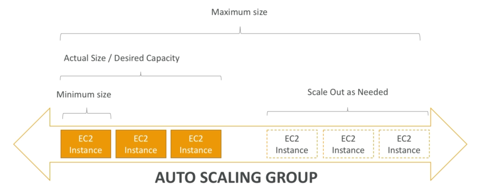
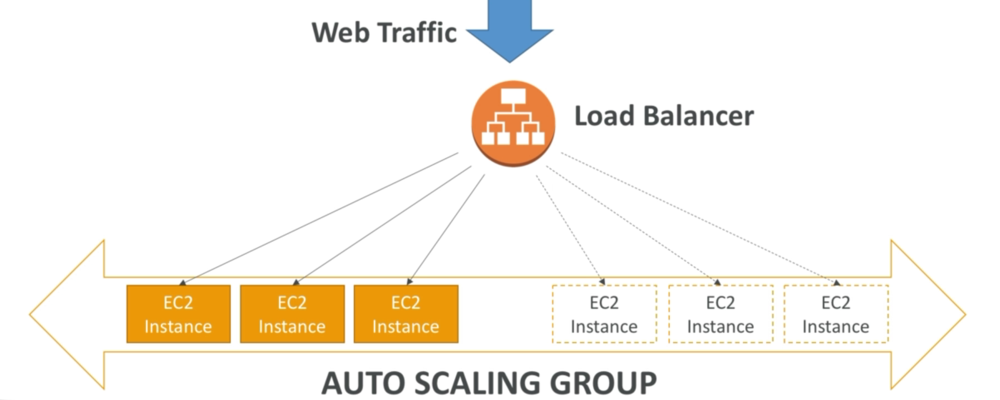

<!-- START doctoc generated TOC please keep comment here to allow auto update -->
<!-- DON'T EDIT THIS SECTION, INSTEAD RE-RUN doctoc TO UPDATE -->
**Table of Contents**

- [Horizontal Scalability](#horizontal-scalability)
- [High Availability](#high-availability)
- [For EC2](#for-ec2)
- [Load Balancers](#load-balancers)
- [Load Balancer Stickiness](#load-balancer-stickiness)
- [LB common troubleshooting](#lb-common-troubleshooting)
- [Request Tracing](#request-tracing)
- [CloudWatch Metrics for ASG](#cloudwatch-metrics-for-asg)

<!-- END doctoc generated TOC please keep comment here to allow auto update -->

# EC2 High Availability and Scalability

## What is it?

- Scalability means that an application / system can handle greater loads by adapting.
- There are two kinds of scalability
  - Vertical
  - Horizonal (elasticity)

### Vertical Scalability

- Increases the size of an instance.
- E.g: application runs on t2.micro. We want to run it on t2.large.
- Common for non-distributed systems, such as a database
- E.g. RDS, Elasticache are services that can scale vertically
- Usually a limit to how much you can vertically scale (hardware limit)

### Horizontal Scalability

- Increase the number of instances/systems for an application.
- Instead of doubling the size of an instance, provision _another_ instance.
- Implies that systems are distributed.
- Common for web applications / modern applications.
- Easy to horizontally scale.

### High Availability

- Usually goes hand in ahnd with horizontal scaling.
- Running your application in at least 2 data centers (availability zones).
- The goal of high availability is to survive data center loss.
- Can be passive (RDS Multi AZ)
- Availability can be active (for horizontal scaling)

### For EC2

- Vertical Scaling: increase instance size
  - e.g. t2.nano 0.5GB, 1vCPU -> u-12tb1.metal - 12.3TB RAM, 448 vCPUs
  -
- Horizontal: Increase number of instances (aws terms = scale out or in)

  - Auto scaling group
  - Load balancer

- High Availability; Run instances for the same application across multiple AZs
  - Auto Scaling Group multi AZ
  - Load Balancer multi AZ

## Load Balancing

- Servers that forward internet traffic to multiple servers (EC2s) downstream.
- Users initially connect to the load balancer. The load balancer redirects traffic between EC2 instances.

### Why use a load balancer?

- Spread load across multiple downstream instances.
- Expose a single point of access (DNS) to your application.
- Seamlessly handle failures of downstream instances.
- Do regular health checks to your instances.
- Provide SSL termination (HTTPS) for your websites.
- Enforce stickiness with cookies.
- High availability across zones.
- Can separate public traffic from private traffic.

There is an ELB (Elastic Load Balancer) called EC2 Load Balancer. This is a **managed load balancer**.

- AWS gauarantees that it will be working
- AWS takes care of upgrades, maintenance, high availability.
- AWS provides only a few configuration knobs.

- Costs less to set up your own load balancer, but will be more effort for the SysAdmin.
- Integrated with many AWS offerings / services

### Load Balancers

AWS has 3 kinds of load balancers

- Classic Load Balancer (v1, 2009)
- Application Load Balancer (v2, 2016)
- Network Load Balancer (v2, 2017)
- Recommended to use v2 generation load balancers as they provide more features.
- You can setup internal and external load balancers

#### Health Checks

- Crucical for load balancers
- Enable load balancer to know if instances it forwards traffic to are availabile to respond to requests
- The health check is done on a port and a route /health is common. **You** specify these parameters.
- Response is 200 for OK. If Response != 200, instance is unhealthy.

#### Application Load Balancer, ALB (v2)

- Load balancing to multiple HTTP applications across machines (target groups)
- Load balancing to multiple applications on the same machine (e.g. containers)
- Load balancing based on route in URL
- Load balancing based on hostname in URL
- Great for micro services & container-based application (e.g. Docker, Amazon ECS)
- Has port mapping feature to redirect to a dynamic port.
- We would need to create a classic load balancer per application using the v1 LB.

Good to know:

- Stickiness can eb enabled at the target group level

  - Same request goes to same instance
  - Directly generated by ALB (not the application)
  - ALB support HTTP/HTTPS & Websockets protocols

- The application serevrs dont see the IP of the client directly
  - The true IP of the client is inserted in the header X-Forwarded-For
  - We can also get Port(X-Forwarded-Port) and proto (X-Forwarded-Proto)

#### Network Load Balancer, NLB (v2)

- Layer 4
- Forward TCP traffic to your instances
- Handle millions of requests per second
- Support for static IP or elastic IP
- Less latency (100ms vs 400ms for ALB)
- **Mostly used for extreme performance and should not be the default load balancer you choose.**
- Creation process is the same as the ALB.

Good to know:

- Classic LB is deprecated:
  - Use Application Load Balancers for HTTP / HTTPS & Websocket.
  - Use Network Load Balancer for TCP.
- CLB and ALB support SSL certificates andprovide SSL termination
- All LBs have health check capability
- ALB can route based on hostname / path
- ALb is great fit with ECS (Docker).
- Any LB has a static hostname. **Do not resolve and use underlying IP.** This is a common exam question
- LBs can scale but not instantaneously - contact AWS for a "warm-up"
- NLB directly see the client IP.
- 4xx errors are client induced errors.
- 5xx errors are application induced errors
  - 503 means the LB is at capacity, or no registered target is provided
- If the LB can't connect to your application, check your security groups!!

### Load Balancer Stickiness

- It is possible to implement stickiness so that the same client is always redirected to the same instance behind a load balancer.
- This works for both CLBs and ALBs.
- It works with cookies, which have an expiration date that you control.
- Use case: make sure the user doesn't lose their session data.
- Enabling stickiness may bring imbalance to the load over the backend EC2 instances.

#### Elastic Load Balancers for SysOps

Application Load Balancer:
_ Layer 7 (HTTP, HTTPS, Websocket)
_ URL based routing (hostname or path)
_ does not support static IP, but has fixed DNS.
_ Provide SSL termination.

Network Load Balancer:
_ Layer 4 (TCP)
_ No pre-warming needed for load balancer.
_ 1 static IP per subnet
_ So SSL termination (SSL must be enabled by the application itself)

Exam tip: Chain a NLB and an ALB together to give the ALB a fixed IP.

Pre-warming

- ELB scale gradually to traffic
- ELB may fail in case of sudden spike of traffic (10x traffic)
- If you expect high traffic, open a support ticket with AWS to pre-warm your ELB. This means scaling up your ELB in advance.
  - Duration of traffic
  - Expected requests per second
  - Size of requests (in KB)

Error Codes

- **200 - successful request** <-
- **4xx - unsuccessful at client side** <-
  - 400 - bad request
  - 401 - unauthorised
  - 403 - forbidden
  - 460 - client closed connection
  - 463 - X-Forwarded For header with >30 IP (similar to malformed request)
- 5xx- unsuccessful at server side
  - 500 - internal server error (error on ELB)
  - 502 - bad gateway
  - **503 - Service unavailable** <-
  - 504 - gateway timeout, probably an issue within the server
  - 561 - unauthorised

<- need to know for exam

Supporting SSL for Old Browsers

**Common question:**
How do we support legacy browsers that have an old TLS (TLS 1.0)?

Answer: change the policy to allow for weaker cipher e.g. DES-CBC3-SHA

Only a very small % of the internet uses TLS 1.0
ELB provides security policies for ALB

### LB common troubleshooting

- Check security groups on LB and EC2.
- Check health checks.
- Sticky sessions may bring imbalance on the LB side.
- For multi-az load balancing, ensure cross zone balancing is enabled (classic load balancer)
- Internal load balancer for private applications that don't need public access.
- Enable Deletion Protection to prevent against accidental deletes.
  - Go to LB -> scroll down to Attributes. Enable Delete Protection.

## Load Balancers Monitoring

* All load balancer metrics are directly pushed to CloudWatch. 

Here are the typical metrics:
  * BackendConnectionErrors
  * HealthyHostCount/UnhealthyHostCount
  * HTTPCode_Backend_2XX:Successful
  * HTTPCode_Backend_3XX:redirected request
  * HTTPCode_Backend_4XX:client error
  * HTTPCode_Backend_5XX:server error
* Latency
* RequestCount 
* SurgeQueueLength:
* The total number of requests (HTTP listener) or connections (TCP listener) that are pending routing to a healthy instance. Help to scale out ASG. **Maximum value is 1024.**
* SpilloverCount: the total number of requests that were rejected because the surge queue is full.

## Load Balancers Access Logs

* Access logs from Load Balancers can be stored in S3 and contain:
  * Time
  * Client IP
  * Latencies
  * Request paths
  * Server response
  * Trace ID
* Only pay for S3 storage
* Helpful for compliance & auditing.
* Helpful for keeping access data even after ELB or EC2s are terminated.
* Access Logs are already encrypted.

### Request Tracing

* Request tracing - each HTTP request has an added custom header X-Amzn-Trace-ID
* Useful in logs / distributed tracing platform to track a single request.
* Not integrated with X-Ray.

## Troubleshooting

* HTTP 400: BAD_REQUEST - client sent a malformed response that does not meet HTTP specifications
* HTTP 503: Service Unavailable - ensure you have healthy instances in every AZ that your LB is configured to respond in. Look for HealthyHostCount in CloudWatch.
* HTTP 504: Gateway Timeout - Check if keep-alive settings on EC2 instances are enabled and make sure that the keep-alive timeout is greater than the idle timeout settings of the load balancer.
* Set alarms and look at the documentation for troubleshooting.

## Auto Scaling Groups

* Load on websites and applications can change.
* In the cloud, you can create and destroy instances quickly.
* ASGs:
  * Scale out to match increase load.
  * Scale in to match decreased load.
  * Ensure we have a minimum and maximum number of machines running
  * Automatically register new instances to a load balancer

With a load balancer:

ASGs have the following attributes:
* A launch configuration
  * AMI + instance type
  * EC2 user data
  * EBS volumes
  * Security Groups
  * SSH key pair
* Min size / max size / initial capacity
* Network + subnet information
* Load Balancer information
* Scaling Policies 
* Health checks can be based on EC2 or ELB status reports.

### Auto Scaling Alarms

* Possible to scale an ASG based on CloudWatch alarms
* Alarm monitors a metric (e.g. average CPU)
* Metrics are computed for the overall ASG instances
* Based on the alarm
  * We can create scale out policies
  * We can create scale in policies

* It is now possible to define "better" auto scaling rules that are dirwctly managed by EC2
  * Target average CPU usage
  * Number of requests on the ELB per instance
  * Average network in
  * Average network out

### Custom Metrics

* We can auto scale based on a custom metric (e.g. number of connected users)
  * Send a custom metric from app on EC2 to CloudWatch (PutMetric API)
  * Create CloudWatch alarm to react to low / high values.
  * Use the CloudWatch alarm as the scaling policy for ASG.

### Brain Dump

* Scaling policies can be on CPU, Network and even custom emtrics, or based on a schedule.
* ASGs use Launch configurations and you update an ASG by providing a new launch config.
* IAM roles attached to an ASG will get assigned to EC2 instances
* ASGs are free. You pay for the underlying resources being provisioned.
* Having instances under an ASG means that if they get terminated for whatever reason, the ASG will restart them. Ensures availability.
* ASG can terminate instances marked as unhealthy by a LB and hence replace them.

Common exam question

ELB health check for an EC2 is unhealthy, in the target group the EC2 is Healthy. Switch ASG health check type from `EC2` to `ELB`. The unhealthy instance will now be terminated, and a new EC2 provisioned.

### Scaling Processes in ASG

Very common, should know these for the exam:
* Launch: add a new EC2 into the group, increases capacity
* Terminate: remove EC2 from group, decrease capacity
* HealthCheck: checks health of the instances
* ReplaceUnhealthy: terminate unhealthy instances and recreate
* AZRebalance: Balance the number of EC2 instances across AZ. **COMMON EXAM QUESTION**
  * Imbalance in AZ spread
  * Launch new instance, then terminate old instance.
  * If you suspend Launch process, this will inhibit AZRebalance.
  * If you suspend Terminate process, this will inhibit AZRebalance
  * If you suspend the Terminate process, the ASG can grow up to 10% of its size (allowed during rebalances)
  * ASG will remain at the increased capacity, as it can't terminate instances.

Less common:
* AlarmNotification: Accept Notification from CloudWatch.
* ScheduledActions: Performs scheduled actions that you create.
* AddToLoadBalancer: adds instances to the load balancer or target group.

We can suspend all of the above processes! The ASG will not perform suspended processes.

Fun Fact: You can modify instance health via the CLI.

### ASG for SysOps

* To ensure high availability, you need at least 2 instances running across 2 AZs in your SG (must first configure multi AZ ASG)
* Health checks available:
  * EC2 Status Checks
  * ELB Health Checks
* ASG will launch a new instance after terminating an unhealthy one.
* ASG will not reboot unhealthy hosts for you.
* Good to know CLI:
  * set-instance-health
  * terminate-instance-in-auto-scaling-group

### Troubleshooting ASG

* Number of instances are already running. Launching EC2 failed.
  * ASG has reached the limit set by the DesiredCapacity. Update the ASG by providing a new value for the desired capacity
* Launching EC2 instances is failing
  * SGs does not exist. SG may have been deleted
  * Key pair does not exist. May have been deleted
* If the ASG fails to launch an instance for over 24 hours, it will automatically suspend the processes (administration suspension).

### CloudWatch Metrics for ASG

* Following metrics are available:
  * GroupMinSize
  * GroupMaxSize
  * GroupDesiredCapacity
  * GroupInServiceInstances
  * GroupPendingInstances
  * GroupStandbyInstances
  * GroupTerminatingInstances
  * GroupTotalInstances
* Should enable metric collection to see the metrics
  * Collected every minute.

You can also monitor the underlying EC2s:
* Basic monitoring: 5 minute granularity
* Detailed monitoring: 1 minute granularity (paid option)
