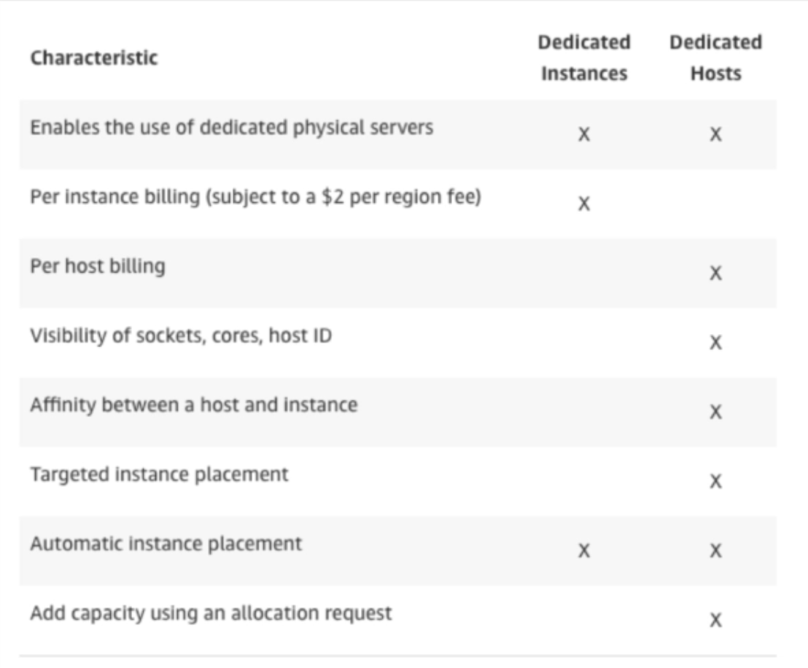

<!-- START doctoc generated TOC please keep comment here to allow auto update -->
<!-- DON'T EDIT THIS SECTION, INSTEAD RE-RUN doctoc TO UPDATE -->

**Table of Contents**

- [EC2 for SysOps](#ec2-for-sysops)
  - [Placement Groups](#placement-groups)
  - [Termination Protection](#termination-protection)
  - [Troubleshooting EC2 launch issues](#troubleshooting-ec2-launch-issues)
    - [InstanceLimitExceeded](#instancelimitexceeded)
    - [InsuffcientInstanceCapacity](#insuffcientinstancecapacity)
    - [Instance terminates immediately](#instance-terminates-immediately)
  - [Troubleshooting EC2 SSh issues](#troubleshooting-ec2-ssh-issues)
    - [Private key permissions](#private-key-permissions)
    - [Username for OS](#username-for-os)
    - [Connection timeout](#connection-timeout)
  - [Instance Launch Types](#instance-launch-types)
    - [On Demand Instances: short workload, predictable pricing.](#on-demand-instances-short-workload-predictable-pricing)
    - [Reserved instance: long workloads (>= 1 year).](#reserved-instance-long-workloads--1-year)
    - [Convertible Reserved Instances: long workloads with flexible instances.](#convertible-reserved-instances-long-workloads-with-flexible-instances)
    - [Scheduled Reserved Instances: launch within reserved time window.](#scheduled-reserved-instances-launch-within-reserved-time-window)
    - [Spot Instances: short workloads for cheap, can lose instances.](#spot-instances-short-workloads-for-cheap-can-lose-instances)
    - [Dedicated hosts: book an entire physical server, control instance placement.](#dedicated-hosts-book-an-entire-physical-server-control-instance-placement)
    - [Dedicated instance: no other customers share hardware.](#dedicated-instance-no-other-customers-share-hardware)
    - [Which host is right for me?](#which-host-is-right-for-me)
  - [EC2 Instance Types](#ec2-instance-types)
    - [R](#r)
    - [C](#c)
    - [M](#m)
    - [I](#i)
    - [G](#g)
    - [T](#t)
      - [T2/T3 burstable](#t2t3-burstable)
      - [T2/T3 unlimited](#t2t3-unlimited)
  - [EC2 AMIs](#ec2-amis)
    - [Custom AMI advantages:](#custom-ami-advantages)
    - [Public AMIs](#public-amis)
    - [Storage](#storage)
    - [Pricing](#pricing)
    - [Creating AMIs](#creating-amis)
    - [Sharing AMIs between AWS accounts](#sharing-amis-between-aws-accounts)
    - [EXAM TIP](#exam-tip)
  - [Elastic IPs](#elastic-ips)
  - [CloudWatch Metrics for EC2](#cloudwatch-metrics-for-ec2)
    - [EC2 included metrics](#ec2-included-metrics)
    - [EC2 custom metrics](#ec2-custom-metrics)
  - [CloudWatch Logs for EC2](#cloudwatch-logs-for-ec2)

<!-- END doctoc generated TOC please keep comment here to allow auto update -->

# EC2 for SysOps

## Placement Groups

- Cluster – only 7 instances in a cluster, shares the same hardware (rack)

- Spread – instances located on different hardware (different rack)

## Termination Protection

Command Line shutdown will terminate instance unless termination protection is enabled.

## Troubleshooting EC2 launch issues

### InstanceLimitExceeded

Maximum number of EC2s reached in that region. Open support ticket with AWS to increase this value. Max number by default is 20. This is a soft limit that can be increased by opening a support ticket.

Go to EC2 Dashboard -> Limits to view resource limits of EC2s.

### InsuffcientInstanceCapacity

AWS does not have the capacity to launch your request. Try again after a short amount of time. If trying to spin up multiple instances, try one at a time.

### Instance terminates immediately

State of EC2 goes from Pending -> terminated

• Reached EBS volume limit
• EBS snapshot corrupt
• Root EBS volume is encrypted and you don’t have permissions ot access KMS key for decryption
• Instance stored-backed AMI that you used to launch the instance is missing a required part (image.part.xx file)

Go to EC2 dashboard, View instance attributes (click the cog on the top right and enable **State Transition Reason**)

View the State Transition Reason in the table below.

## Troubleshooting EC2 SSh issues

### Private key permissions

- Ensure private key (pem) file has 400 permissions (via `chmod 400 key.pem`) - otherwise you will get "Unprotected Private Key File error".

### Username for OS

Ensure the login username is correct (depends on the AMI) else you will get "Host key not found" error.

| OS/Distro            | Official AMI |
| -------------------- | ------------ |
| ssh                  | Username     |
| Amazon Linux         | ec2-user     |
| Ubuntu               | ubuntu       |
| Debian               | admin        |
| RHEL 6.4 and later   | ec2-user     |
| RHEL 6.3 and earlier | root         |
| Fedora               | fedora       |
| Centos               | centos       |
| SUSE                 | ec2-user     |
| BitNami              | bitnami      |
| TurnKey              | root         |
| NanoStack            | ubuntu       |
| FreeBSD              | ec2-user     |
| OmniOS               | root         |

### Connection timeout

- Incorrectly configured security group.
- CPU load of instance is too high.

## Instance Launch Types

### On Demand Instances: short workload, predictable pricing.

- Pay for what you use (billing per second after first minute)
- Highest cost, no upfront payment
- No long term commitment.
- Recommended for short-term, un-interrupted workloads, where you cant predict how the application will behave.

### Reserved instance: long workloads (>= 1 year).

- Up to 75% discount compared to On-demand.
- Pay upfront for what you use with long term commitment.
- Reservation period can be 1 or 3 years.
- Reserve a specific instance type.
- Recommended for steady state usage applications(e.g. database).

### Convertible Reserved Instances: long workloads with flexible instances.

- Convert and change instance type
- up to 54% discount

### Scheduled Reserved Instances: launch within reserved time window.

- Launch within time window you reserve

### Spot Instances: short workloads for cheap, can lose instances.

- Discount of up to 90% compared to On-demand.
- Bid a price and get the instance as long as its under the bid price.
- If you are outbid you will lose the instance.
- Price varies based on offer and demand.
- Reclaimed with a 2 minute notification warning when the spot price goes above your bid.
- Used for batch jobs, Big Data analysis, or workloads that are resilient to failure.
- Not great for critical jobs or databases.

### Dedicated hosts: book an entire physical server, control instance placement.

- Physical dedicated EC2 server.
- Full control of EC2 instance placement.
- Visibility into the underlying sockets / physical cores of the hardware.
- Allocated for your account with a 3 year period reservation.
- More expensive, more control.
- Userful for software licensing model (Bring Your Own License)
- Or companies that have strong regulatory or compliance needs.

### Dedicated instance: no other customers share hardware.

- Instance running on hardware thats dedicated to you.
- May share hardware with other instances in same account.
- No control over instance placement (can move hardware after Stop / Start).

You can view the difference between Dedicated Hosts and Instances in this table:

### Which host is right for me?

Imagine you want to stay in a hotel.

- On Demand: walk up to the hotel front desk when ever we want and pay the full price for the room.
- Reserved: planning ahead, if we plan to stay for a long time we may get a good discount.
- Spot instances: the hotel allows people to bid for empty rooms and the highest bidder keeps the rooms. You can get kicked out at any time.
- Dedicated: book the entire building.

## EC2 Instance Types

[Here is a website with an overview of ALL ec2 instances and types](https://ec2instances.info)

There are loads of different types of EC2 instances, you don't need to know them all in great detail, just the main ones:

### R

R for RAM.

Applications that need a lot of RAM - in memory caches.

### C

C for CPU

Applications that need a good CPU - compute / databases.

### M

Applications that are balanced - think "medium" - general / web app.

### I

Applications that need good local I/O (instance storage) - databases.

### G

Applications that need a GPU - video rendering / machine learning.

### T

#### T2/T3 burstable

Burstable instances (up to a capacity).

- Burst means that overall, the instance has OK CPU performance.
- When the machine needs to process something unexpected (e.g. a spike in load), it can burst, and the CPU can be very good.
- When the CPU bursts, it uses burst credits.
- If all the credits are gone, the CPU becomes bad.
- If the machine stops bursting, credits are accumulated over time.
- Burstable instances can be amazing to handle unexpected traffic and getting the insurance that it will be handled correctly.
- If your instance consistently runs low on credit, you need to move to a different kind of non-burstable instance.
- You can view the credit usage and credit balance in CloudWatch.
- Different instances accumulate differing numbers of credits per hour

#### T2/T3 unlimited

Unlimited burst.

- You pay extra money if you go over your credit balance, but you don't lose performance.
- New offering, so be careful, costs can be high if you're not monitoring the health of your instanes.

## EC2 AMIs

- Amazon Machine Image
- AWS comes with many base images e.g. Ubuntu, RedHat, Fedora, Windows etc.
- These images can be customised at runtime using EC2 User data. They can be customised for Linux or Windows machines.
- Custom AMIs are specific to regions. They are not global. Once you have created an image, you can copy it to other regions.
- AMIs can be found and published on the Amazon Marketplace
- Do your due dilligence, some AMIs may contain malware. Only use AMIs from authors you trust.

### Custom AMI advantages:

- Pre-installed packages needed
- Faster boot time
- Machine comes configured with monitoring / enterprise software
- Security concerns - contorl over the machines in the ntwork
- Control of maintenance and updates of AMIs over time
- Active Directory integration out of the box
- Installing your app ahead of time (for faster deployment when auto-scaling)
- Using someone elses AMI that is optimised for running an app, DB etc.

### Public AMIs

- Leverage AMIs from other people
- You can pay for other peoples AMI by the hour.
  - These people have optimised the software
  - The machine is easy to run and configure
  - You basically rent "expertise" from the AMI creator

### Storage

- Your AMI take space and live in Amazon S3
- S3 is durable, cheap and resilient storage where most of your backuos will live.
- Your AMIs are private by default and locked to your region.
- You can make your AMIs public and share them with other AWS accounts or sell them on the AMI Marketplace.

### Pricing

- AMI live in S3, so you get charged for storage.
- Inexpensive.
- Remove AMIs you don't use.

### Creating AMIs

- Install your desired packages on an EC2.
- Go to the EC2 Dashboard, right click the instance and select "create image".
- Create an instance from this image, and your preinstalled packages (basically anything you installed on that EC2) will be installed on the new instance.

### Sharing AMIs between AWS accounts

- You can share an AMI with another AWS account.
- Sharing an AMI does not affect the ownership of the AMI.
- If you _copy_ an AMI that has been shared with your account, you are the owner of the target AMI in your account.
- To copy an AMI that was shared with you from another account, the owner of the source AMI must grant you read permissions for the storage that backs the AMI - either the associated EBS snapshot (for Amazon EBS-backed AMI) or an associated S3 bucket (for an instance store-backed AMI).

Limits:

- You can't copy an encrypted AMI that was shared with you from another account. Instead, if the underlying snapshot and encryption key were shared with you, you can copy the snapshot while rencrypted it with a key of your own. You own the _copied_ snapshot, and can register it as a new AMI.

### EXAM TIP

- You can't copy an AMI with an associated `billingProduct` code that was shared with you from another account. This includes Windows AMIs and AMIs from the AWS Marketplace. To copy a shared AMI with a `billingProduct`, launch an EC2 instance in your account using the _shared_ AMI, then create an AMI from that instance.

## Elastic IPs

- When you stop and start an EC2 instance, it changes the public IP.
- To keep a fixed public IP, you need an Elastic IP.
- An elastic IP is a public IPv4 IP you own as long as you don't delete it.
- You can attach it to one instance at a time.
- You can remap it across instances.
- You don't pay for the Elastic IP if its attached to a server.
- You pay for the Elastic IP if its not attached to a server.

- With an Elastic IP address, you can mask the failure of an instance or software by rapidly remapping the address to another instance in your account.
- You can only have 5 Elastic IP addresses in your account (you can ask AWS to increase this soft limit).

- Try to avoid using Elastic IP:

  - Always think of other alternatives available to you.
  - You could use a random public IP and register a DNS name to it.
  - Or use a Load Balancer with a static hostname.

- On the EC2 dashboard, once you have assigned an Elastic IP to an instance, in the Instance Description tab, you will see the IPv4 Public IP is now a URL. This is how you know you are using an Elastic IP.

## CloudWatch Metrics for EC2

- AWS provided Metrics (AWS pushes them)

  - Basic monitoring: collected at 5 minute intervals
  - Detailed monitoring: collected at 1 minute intervals
  - Includes CPU, Network, Disk and Status Check Metrics.
  - Does not include RAM.

- Custom Metric (yours to push)

  - Basic resolution: 1 minute resolution
  - High resolution: all the way to 1 second resolution
  - Includes RAM, application level metrics
  - Make sure the IAM permissions on the EC2 instance role are correct! Must be able to push to CloudWatch.

- AM permissions required:
  - cloudwatch:PutMetricData
  - cloudwatch:GetMetricStatistics
  - cloudwatch:ListMetrics
  - ec2:DescribeTags

### EC2 included metrics

- CPU: CPU utilization + credit usage / balance
- Network: Network in / out
- Status Check:
  - Instance status = check the EC2 VM is working.
  - System Status = check the underlying hardware is working.
- Disk: Read / Write for Ops / Bytes (only for instance store backed EC2s)

**RAM IS NOT INCLUDED IN THE AWS EC2 METRICS**

### EC2 custom metrics

- Sample custom metrics for EC2:
  - RAM usage
  - Swap usage
  - Any custom metric for your app, requests per second etc.

Use the CloudWatch monitoring scripts to push RAM usage to CloudWatch. These scripts are available on the AWS website.

## CloudWatch Logs for EC2

- By default, no logs from your EC2 will go to CloudWatch.
- You need to run a CloudWatch agent on an EC2 to push the log files you want (e.g. a specific application).
- You can run the CloudWatch log agent on your onprem hardware too!

`sudo yum install -y awslogs`
