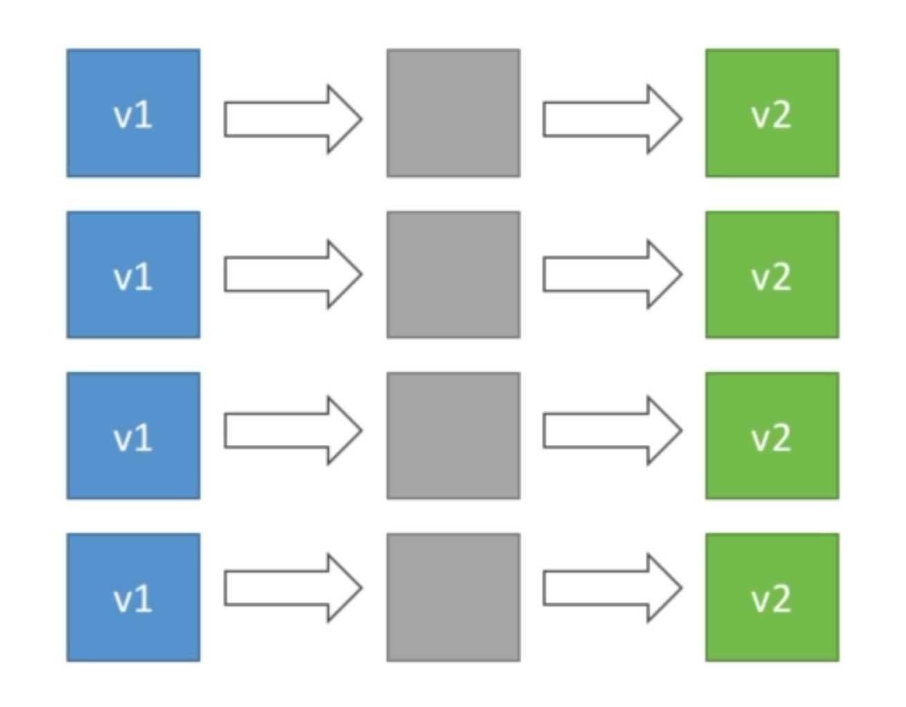
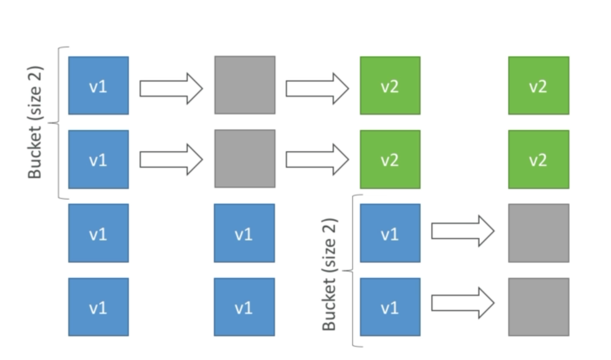
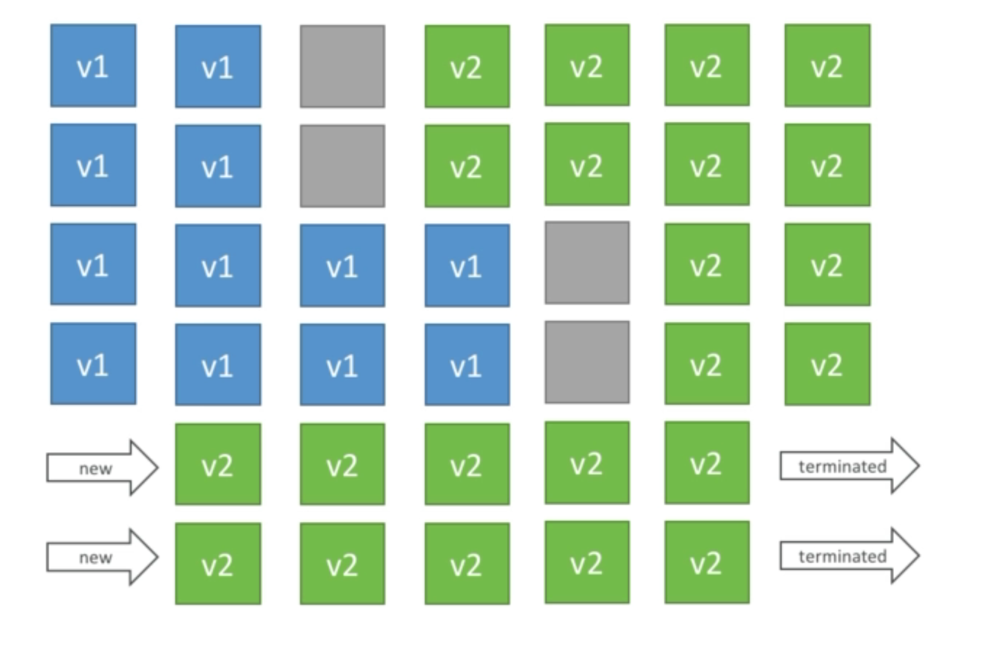
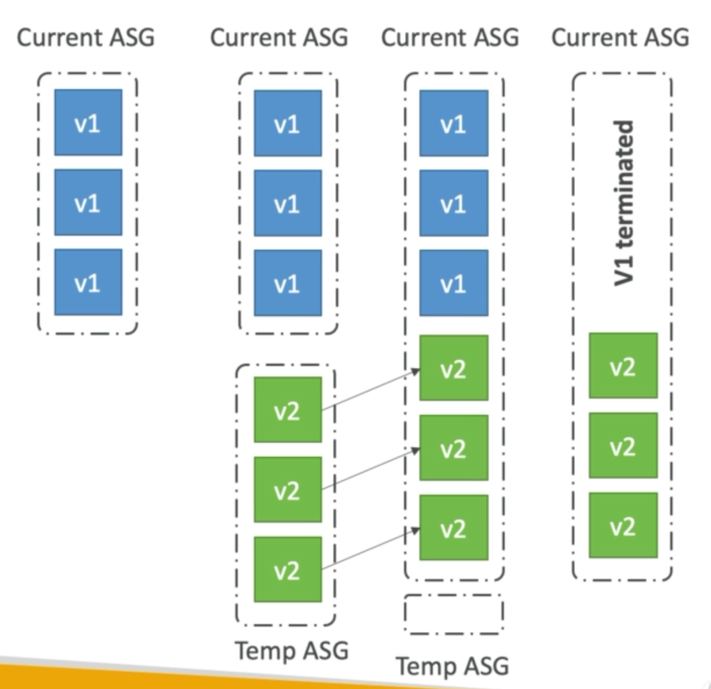

# Elastic Beanstalk for SysOps

Beanstalk features heavily in the Developer Associate exam, however there is still some things you'll need for SysOps.

## Overview

Developer problems on AWS:
* Managing infrastructure
* Deploying Code
* Configuring all the databases, load balancers, etc
* Scaling concerns
* Most web apps have a similar architecutre, ALB + ASG.
* All the devs want is the code to run
* Possibly, consistently across different applications and environments.

Enter ElasticBeanstalk - A developer centric view of deploying an application on AWS. It uses all the components we've seen before, EC2, ASG, ELB, RDS etc.

* All in one view that's easy to understand.
* Still have full control over the configuration
* It's free. You only pay for the resources provisioned.
  
* Managed Service
  * Instance config / os is handled by Beanstalk
  * Deployment strategy is configurable but performed by BeanStalk
  
* Three architecture models:
  * Single instance of deployment, good for devs
  * LB + ASG: great for prod or pre-prod web apps
  * ASG only: great for non-web apps in prod.

BeanStalk has three components:
* Application
* Application version (each deployment is assigned a version)
* Environment anme (dev, test, prod)

You deploy the app versions on environments and can promote application version to the next environment. Rollback feature to previous application version. Full control over lifecycle of environments.

Support for may platforms
* Go
* Java
* .NET
* Node.js
* PHP
* Python
* etc

## BeanStalk Deployment Modes

Single instance deployment, great for a developer, one EC2, one elastic IP, one SG, one AZ. Easy to manage.

High availability with load balancer, great for prod. Contains an ELB, ASG, multiple EC2 instances, SGs, etc.

What about when you want to update a deployment?

### All At Once

* Deploy all in one go
* Fastest
* Instances aren't available to serve traffic for a bit (downtime)
* No additional cost

### Rolling

* Update a few instances at a time (bucket of instances), then moves on to the next bucket once the first bucket is healthy.
* App runs below capacity
* Can set the bucket size
* Both versions run simultaneously.
* No additional cost.

### Rolling with additional batches

* Like rolling, but spins up new instances to move the batch (so that the old application is still available)
* **Application runs at capacity.**
* Can set the bucket size.
* Both versions run simultaneously.
* Small additional cost
* Additional batch is removed at the end of the deployment
* Longer deployment
* Great for production

First deploys new instances, then scales down one batch of instances which are then updated. Then subsequent batches are taken down and updated. 

### Immutable

* Spins up new instances in a **new** ASG, deploys version to these instances, and then swaps all the instances when everything is healthy.
* Zero downtime.
* New Code is deployed ot new instances on a temporary ASG.
* High cost, doubles total capacity.
* Longest deployment.
* Quick rollback in case of failures (just terminate new ASG).
* Great for production.

BeanStalk will create a temp SG with a single instance inside, when that instance reports healthy, the remaining instances will be provisioned.

### Blue / Green

* Not a direct feature of EBS.
* Zero downtime and release facility.
* Create a new stage environment and deploy v2 there.
* New environment (green) can be independently validated and roll back if issues arise.
* Route 53 can be setup using weighted policies to redirect a little bit of traffic to the staged environment.
* Using the BeanStalk console, "swap URLs" when done with the test environment.
* Very manual process.

## BeanStalk for SysOps

* Can put application logs directly in to CloudWatch.
* You manage the app, AWS manages the infrastructure
* Know the different deployment modes for your application (in place, rolling, rolling + batch, immutable)
* Custom domain: Route 53 ALIAS or CNAME on top of BeanStalk URL
* You are not responsible for patching runtimes (Node.js)

## Tricky question - Golden AMI

How does BeanStalk deploy applications?

1. EC2 has a base AMI (can configure this)
2. EC2 gets the new code of the app
3. EC2 resolves the app dependencies (can take a while)
4. Apps get swapped on the EC2 instance

Resolving dependencies can take a long time!

A common question is: how do you decrease dependency resolving time? Solution -> Use the Golden AMI.

If your app has a lot of dependencies and you want to deploy it as quickly as possible, create a Golden AMI.

A Golden AMI = a standardised company-specific AMI with:
* Package OS dependencies.
* Package App dependencies.
* Package company-wide software.

By using a Golden AMI to deploy to BeanStalk (in combination of Blue/Green new ASG deployment), our application wont need to resolve dependencies or a long time to configure. All the dependencies and configurations are already present.

## Troubleshooting BeanStalk

Health = red, try:
* Review environment events
* Pull logs to view recent log file entries
* Roll back to a previous, working version of the application

* When accessing external resources, make sure the security groups are correctly configured.
* In case of command timeouts, you can increase the deployment timeout.